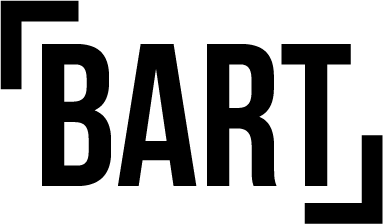
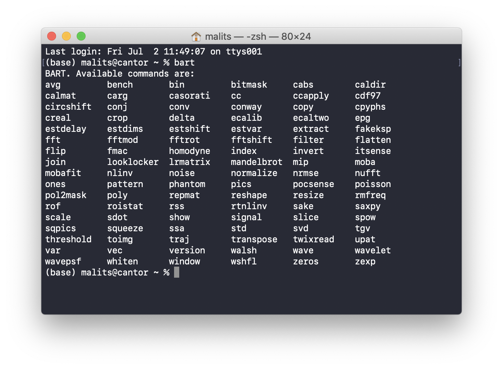
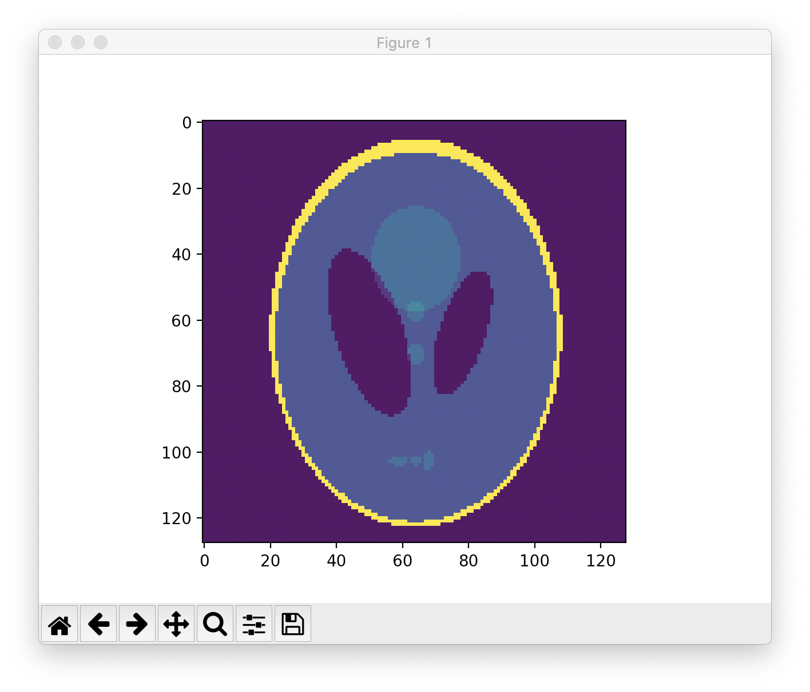

# bartpy

Python bindings for [BART](https://github.com/mrirecon/bart).

## Overview

This repo contains code to generate an updated Python wrapper for the Berkeley Advance Reconstruction Toolbox. The repo aims to expose **command line tools** and **internal library functions** to Python users.

The **command line tools** can be listed by running `bart` from the command line:

Each of these has been exposed to the command-line via the `bartpy.tools` library:

For users looking to integrate BART functions into existing Python workflows, and work fluidly with Numpy, SigPy, or other scientific packages, `bartpy.tools` should suffice!

[In Development] For developers looking to build Python tools using BART's internal C functions, the **internal library functions** expose BART's development libraries to the user. This is currently under production and not accessible via the master branch.

## Requirements

[BART](https://github.com/mrirecon/bart) version 0.7.00. It is important that running a bart command with the `--interface` option is successful. For example, you should see something like the following for running `bart fft --interface`:

[interface](assets/interface.png)

Ensure you have Python >= 3.6 and run `pip install -r requirements.txt` to install necessary dependencies.

## Installation.

To support the growth of BART with minimal overhead, the Python code is autogenerated from a user's BART installation. Run `python3 setup.py install` to build the tools library and install it. If successful, you should be able to import `bartpy.tools` and interface with the tutorials located in the `demos` folder. 